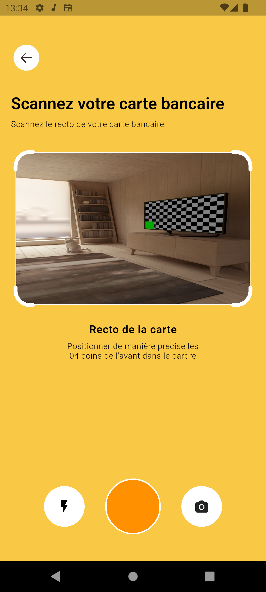
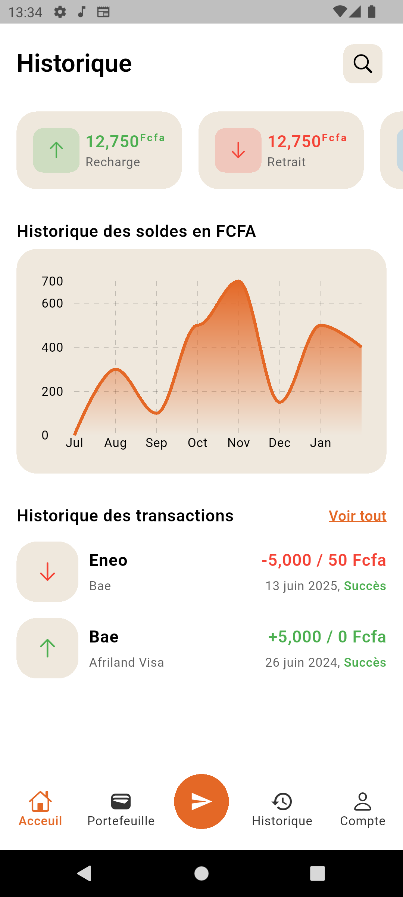
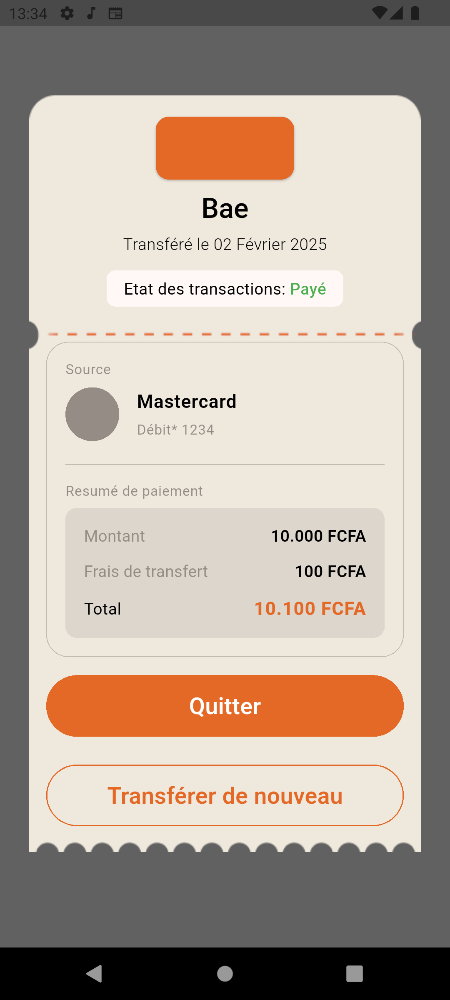

# Viewer X

Une application Flutter pour la reconnaissance de texte et l'analyse d'images.

## Fonctionnalités

- Capture d'images via l'appareil photo
- Reconnaissance de texte avec Google ML Kit
- Visualisation des données avec des graphiques
- Interface utilisateur moderne et réactive

## Prérequis

- Flutter SDK (version 3.8.1 ou supérieure)
- Dart SDK (version 3.1.5 ou supérieure)
- Android Studio / Xcode (pour le développement mobile)
- Un appareil physique ou un émulateur

## Installation

1. Clonez le dépôt :
   ```bash
   git clone https://github.com/Starland9/Flutter-Test.git
   cd viewer_x
   ```

2. Installez les dépendances :
   ```bash
   flutter pub get
   ```

3. Lancez l'application :
   ```bash
   flutter run
   ```

## Configuration

### Android
- Assurez-vous d'avoir un appareil virtuel configuré ou un appareil physique connecté avec le débogage USB activé.

### iOS
- Assurez-vous d'avoir CocoaPods installé et exécutez :
  ```bash
  cd ios
  pod install
  cd ..
  ```

## Captures d'écran

| Capture | Historique | Ticket |
|---------|------------|---------|
|  |  |  |

## Dépendances principales

- `auto_route` : Gestion des routes
- `image_picker` : Sélection d'images
- `google_mlkit_text_recognition` : Reconnaissance de texte
- `fl_chart` : Création de graphiques
- `camera` : Accès à l'appareil photo

## Licence

Ce projet est sous licence MIT. Voir le fichier `LICENSE` pour plus d'informations.

## Auteur

Landry Simo